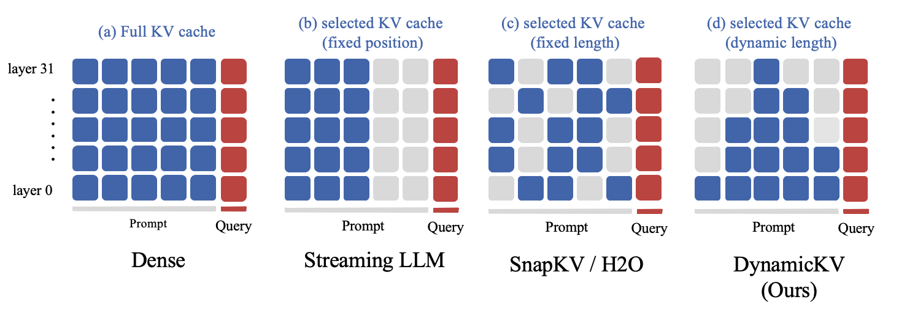
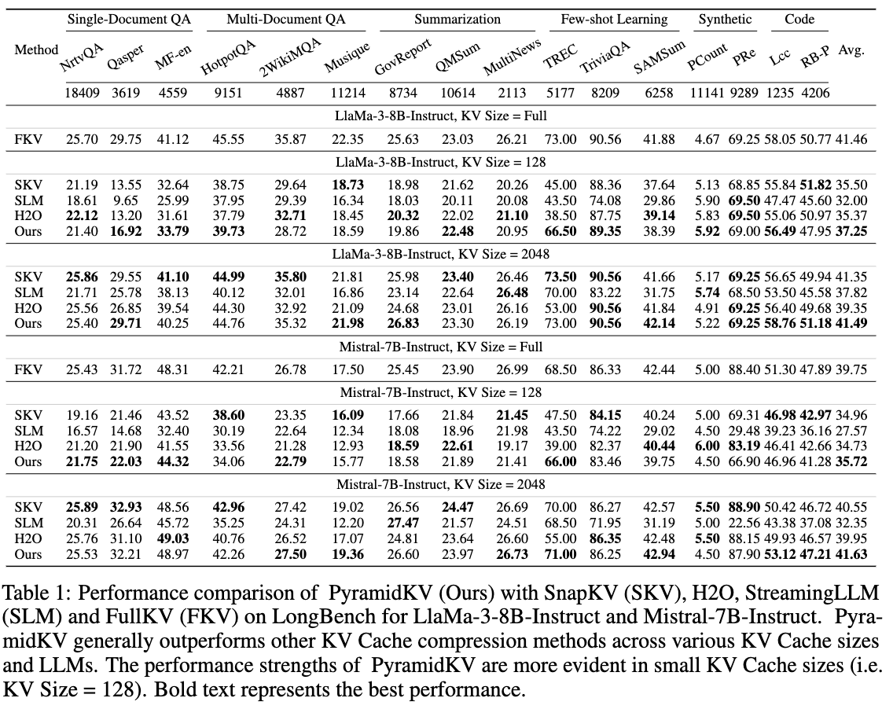
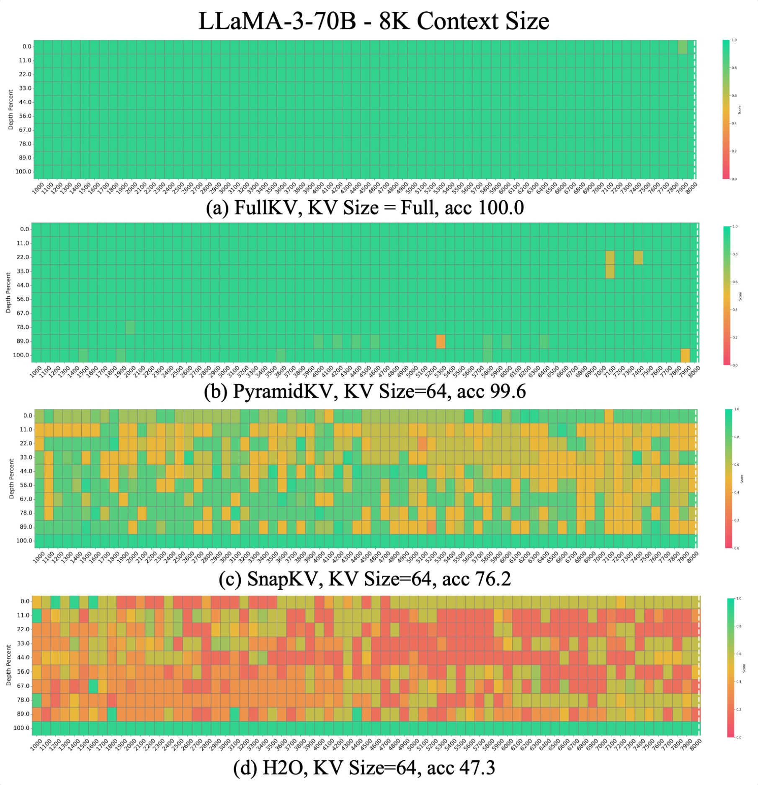
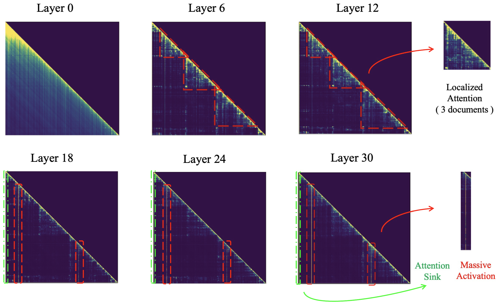

# NTK-KV


<p align="center">
     <br>
</p>

## News

- [2024-10-16] We start researching the approximation of softmax in the KV cache setting to achieve linearization! Second-order linear kernels may have strong approximation capabilities, allowing us to approximate the softmax kernel without training.

## TODO:
- [ ] Support linear kernel approximation of softmax operation.

- [ ] Support approximating softmax using NTK through fine-tuning.

## Performence

<p align="center">
     <br>
</p>

<p align="center">
     <br>
</p>


## Visualization: Inefficient Attention 

The Llama model attention map with 3 documents is represented as follows:

<p align="center">
     <br>
</p>

we provide a notebook `visualization.ipynb` to reproduce the visualization result of each Llama-2-7b-hf model layer for a given 3 document.

Model attention maps for different layers would be stored at `./attention`


## Requirements

```python
transformers >= 4.41
flash-attn >= 2.4.0.post1
```

##  Installation

```python

git clone https://github.com/menik1126/NTK-KV.git
cd NTK-KV
pip install -r requirements.txt .

```

## Inference


We support inference code on `LongBench` to repuduce our result.

Please refer to `scripts/scripts_longBench/eval.sh` to modify the parameters according to your requirements.

Our codebase support Flash Attention v2, Sdpa Attention, etc. The results presented in our paper in based on Flash Attention v2.

```bash
export CUDA_VISIBLE_DEVICES=$1

method=$2 # Support PyramidKV, SnapKV, H2O, StreamingLLM
max_capacity_prompts=64 # 128,2048 in paper
attn_implementation=$3 # Support "flash_attention_2", "sdpa", "eager".
source_path=$4
model_path=$5
save_dir=${source_path}"results_long_bench" # path to result save_dir

python3 run_longbench.py \
    --method ${method} \
    --model_path ${model_path} \
    --max_capacity_prompts ${max_capacity_prompts} \
    --attn_implementation ${attn_implementation} \
    --save_dir ${save_dir} \
    --use_cache True


```

* CUDA_VISIBLE_DEVICES: For multi-GPU inference for big LLMs, just need to specify CUDA_VISIBLE_DEVICES=0,1,2,3,4,5,6,7. For single GPU inference, just need to specify CUDA_VISIBLE_DEVICES=0.
* model_path: Path to your model. Support "Llama-3-8B-Instruct" for now.
* method: Support `PyramidKV`, `SnapKV`, `StreamingLLM`, `H2O`.
* max_capacity_prompts: Selected KV Size in each layer. （e.g. 128, 2048 in paper）. When method is "PyramidKV", given that the total number of KV remains unchanged, the specific KV length for each layer will be modified accordingly
* save_dir: Path to your dir to save LongBench result.

After modifying parameters, run:

```bash 

sh scripts/scripts_longBench/eval.sh

```

## Needle in haystack

We support inference code on `Needle in haystack` to repuduce our result.

Please refer to `scripts/scripts_needle/eval.sh` to modify the parameters according to your requirements.

Our codebase support Flash Attention v2, Sdpa Attention, etc. The results presented in our paper in based on Flash Attention v2.

```

METHOD='h2o'       # ['full', 'pyramidkv', 'snapkv', 'streamingllm', 'h2o']
MAX_CAPACITY_PROMPT=96  # [64, 96, 128, 256, 512, 1024, 2048, ...]
attn_implementation="flash_attention_2" # Support "flash_attention_2", "sdpa", "".
TAG=test


# For Llama3-8b

(
python -u run_needle_in_haystack.py --s_len 1000 --e_len 8001\
    --model_provider LLaMA3 \
    --model_name /mnt/workspace/zhiyuanhu/yuliang/models/llama3-8b_raw \
    --attn_implementation ${attn_implementation} \
    --step 100 \
    --method $METHOD \
    --max_capacity_prompt $MAX_CAPACITY_PROMPT \
    --model_version LlaMA3_${METHOD}_${MAX_CAPACITY_PROMPT}_${TAG}
) 2>&1  | tee results_needle/logs/LlaMA3_${METHOD}_${MAX_CAPACITY_PROMPT}_${TAG}.log

```

* Both LLaMA3 and Mistral2 inference support on single GPU.
* model_provider: LLaMA3 or Mistral2
* model_name: Path to your model. Support "Llama-3-8B-Instruct" "Mistral-7B-Instruct-v0.2" and for now.
* step: The increase of context length.
* method: Support `PyramidKV`, `SnapKV`, `StreamingLLM`, `H2O`.
* max_capacity_prompt: Selected KV Size in each layer. （e.g. 128, 2048 in paper）. When method is "PyramidKV", given that the total number of KV remains unchanged, the specific KV length for each layer will be modified accordingly


To reproduce our results, run

```
bash scripts/scripts_needle/eval.sh
```

After inference, run

`python scripts/scripts_needle/visualize.py` 

to draw the img, you should change `FOLDER_PATH` in `visualize.py` to your output path (the argument of `--model_version` in `eval.sh`).


## Citation

If you find **NTK-KV** useful for your research and applications, please give us a star.


## Acknowledgement


Thanks **[SnapKV]** [SnapKV: LLM Knows What You are Looking for Before Generation](https://github.com/FasterDecoding/SnapKV) for providing open-source code to support the expansion of this project.
